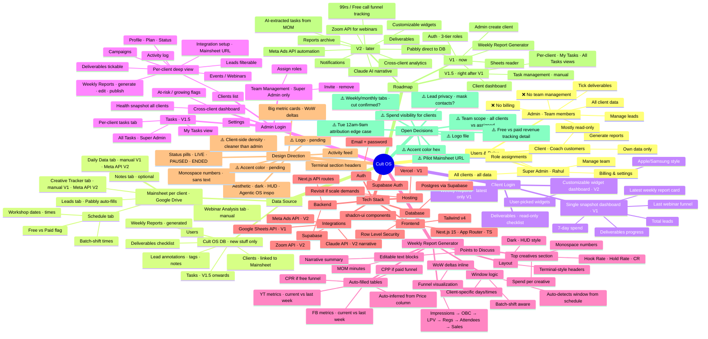

# Cult OS — Feature Mindmap

> Single source of truth for what Cult OS will be.
> Generated 2026-05-26 from conversation with Rahul.
> **Push back on anything that doesn't match your vision.**

---

## Visual mindmap (Mermaid)

Paste this block into any Mermaid renderer (GitHub README, VS Code Mermaid extension, mermaid.live, Obsidian, etc.) to see it as an actual mindmap.

---

## Structured-text version (the same content, readable raw)

### 1. Users & Roles

- **Super Admin** — Rahul (CEO)
  - Manage team members
  - Billing & settings
  - All clients, all data
  - Role assignments
- **Admin** — team members (Shivraj, etc.)
  - All client data
  - Tick deliverables
  - Generate weekly reports
  - Manage leads
  - ❌ Cannot manage billing or team
- **Client** — coach customers
  - Own data only (RLS-enforced)
  - Mostly read-only access

### 2. Data Source Architecture

- **Per-client Google Drive Mainsheet** (source of truth for ad/lead/webinar data)
  - **Schedule tab** — workshop dates, times, batch-shift times, free/paid flag
  - **Leads tab** — Pabbly auto-fills from form submissions
  - **Daily Data tab** — manual entry V1, Meta API V2
  - **Webinar Analysis tab** — manual after each session
  - **Creative Tracker tab** — manual V1, Meta API V2
  - **Notes tab** (optional) — free text
- **Cult OS Database** (new data only — what isn't in sheets)
  - Users (admin + client logins)
  - Clients (linked to their Mainsheet by Drive file ID)
  - Deliverables checklist
  - Weekly Reports (generated + stored)
  - Lead annotations (tags, notes)
  - Tasks (V1.5+)

### 3. Client Login

- **V1 — single snapshot dashboard**
  - 7-day spend
  - Total leads
  - Last webinar funnel
  - Deliverables progress
  - Latest weekly report card
- **V1 — Deliverables tab** (read-only checklist)
- **V1 — Weekly Reports** (latest only, no archive)
- **V2 — Customizable widget dashboard** (Apple/Samsung-style add/remove widgets)

### 4. Admin Login

- **Cross-client dashboard** — health across all clients
- **Clients list** → per-client deep view with tabs:
  - Profile / Plan / Status
  - Leads (filterable)
  - Events / Webinars
  - Campaigns
  - Deliverables (tickable)
  - Weekly Reports (generate, edit, publish)
  - Activity log
  - Integration setup (Mainsheet URL connection)
- **Team Management** (Super Admin only) — invite, remove, assign roles
- **Tasks** (V1.5) — per-client view, "My Tasks" view, "All Tasks" for super admin
- **Settings**

### 5. Weekly Report Generator

- **Window logic** — batch-shift aware, computed from client's schedule
- **Auto-filled tables** — FB + YT, current vs last week, CPR or CPP auto-picked from Price column
- **Funnel visualization** — Impressions → OBC → LPV → Regs → Attendees → Sales with WoW deltas
- **Top Creatives** — Hook Rate / Hold Rate / CR / spend per creative
- **Editable text blocks** — Points to Discuss, MOM, narrative
- **Layout** — dark, HUD-style, monospace numbers, terminal-style section headers

### 6. Tech Stack

- **Frontend:** Next.js 15 (App Router, TS), Tailwind v4, shadcn/ui
- **Backend:** Next.js API routes + Supabase
- **Database:** Postgres via Supabase with Row Level Security
- **Auth:** Supabase Auth (email + password)
- **Hosting:** Vercel (revisit if needed)
- **Integrations:** Google Sheets API (V1), Meta Ads API (V2), Zoom API (V2), Claude API (V2)

### 7. Design Direction

- Dark, HUD/terminal aesthetic (Agentic OS as visual inspiration)
- Monospace numbers, sans text
- Big metric cards with inline WoW deltas (▲ ▼ %)
- Terminal-style section headers — `[ LEADS ]` `[ FUNNEL ]`
- Activity feed
- Status pills — LIVE / PAUSED / ENDED
- Client side slightly cleaner / less dense than admin
- ⚠️ Accent color — pending decision
- ⚠️ Logo — pending file

### 8. Roadmap

- **V1 (now)** — Auth + 3-tier roles → Admin create-client → Sheets reader → Client dashboard → Deliverables → Weekly Report Generator
- **V1.5 (right after V1 ships)** — Task management (manual) with per-client, my-tasks, all-tasks views
- **V2 (later)** — Meta Ads API automation, Pabbly direct to DB, Zoom API, Claude AI narrative, AI-extracted tasks from MOM, notifications, reports archive, customizable widgets, cross-client analytics, 99rs / Free call funnel tracking

### 9. Open Decisions (⚠️ = needs your input before locked)

- ⚠️ Pilot client's Mainsheet URL
- ⚠️ Accent color hex
- ⚠️ Logo file
- ⚠️ Team member scope — all clients vs only assigned ones
- ⚠️ Weekly/monthly tabs — confirmed cut?
- ⚠️ Spend visibility for client side — show raw spend or only CPL/ROAS?
- ⚠️ Lead privacy — mask contact details on client side?
- ⚠️ Tuesday 12am–9am attribution edge case (counts toward outgoing or incoming session?)
- ⚠️ Free vs paid webinar revenue tracking detail

---

## How to use this doc

1. **Read it.** It's the consolidated version of everything we've discussed.
2. **Cross out, scribble, push back** on anything misaligned with your vision.
3. **Answer any ⚠️ items** when you have them — those gate the build.
4. **Reference it** in future sessions so we don't lose context.

The visual mindmap up top and the structured text below are the same content. Pick whichever you prefer to read in.
